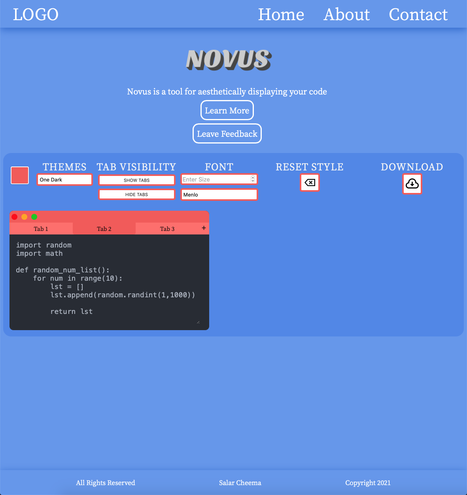
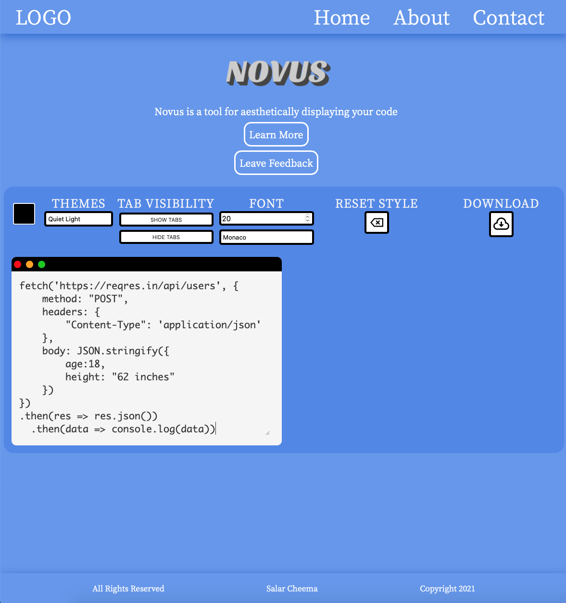

# Novus

[Try it out](https://novus.netlify.app/novus)

## What is it?

Novus is a tool for aesthetically displaying your code. You type your code into a miniature browser and then change the color scheme, font size, font family, and browser color. You can also add more tabs up to a total of 4 tabs. Afterwards, there is an option for you to download a picture of the code or reset it if didn't turn out good

## Inspiration

[Carbon - Create and share beautiful images of your code](http://carbon.now.sh)